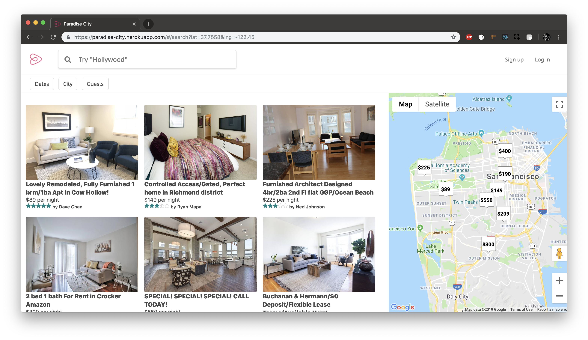

# Paradise City

[Live Demo](https://paradise-city.herokuapp.com/#/)

Paradise City is a single-page Airbnb clone application. Users can search rooms for different places as well as booking them. User can also update their booking and leave reviews for a room. This project makes use of Rails and PostgreSQL on the backend, and React.js and Redux on the frontend.

The project was designed and built within a two-week timeframe, but improvements will be adding over time.

## Technologies
### Backend
* Ruby v2.5.1
* Rails v5.2.2
* Postgresql
### Frontend
* React
* Redux
### APIs
* Google Maps API
* Google Geocoding API
* React Dates
* React Star Rating Component
* Sweetalert

## Features
* Full frontend to backend user authentication using BCrypt.
* Users can search for rooms in any location using the Google Maps API.
* After logged in
  * Users can book a room and update their booking using React Dates calendar.
  * Users can cancel their booking in their profile page.
  * Users can leave reviews for a room

## Splash

The splash page has a search bar in the center of the page. The search function is implemented using Google Maps API and Google Geocoding API. There are sign up and log in buttons on the top-right corner. Modal of a corresponding form is rendered after a button is clicked and user will be redirected to the serach page. User will be redirected back to this page after log out.

## Search for rooms

The search bar on the navigation bar is the same as on the splash page. Default searching result is San Francisco. User can search for any location and the map on the right hand side will be updated. Rooms on the left are reflected according to the markers on the map. Each room is a link to its show page.

## Show page
This page shows all the details of a listing, and provides a form for booking.

When a new booking is being created, data needed to be stored for the booking will be passed from both the global and local state once the submit button is hit.
```js
handleSubmit(e) {
  e.preventDefault();
  const booking = { 
    id: this.props.bookingId,
    start_date: this.state.startDate._d,
    end_date: this.state.endDate._d,
    num_guests: parseInt(this.state.numGuests),
    spot_id: this.props.spot.id,
    guest_id: this.props.currentUserId
  }
  ...
}
```
After logged in, users can leave a review for a listing as well as giving ratings. The average ratings of the listing will be calculated immediately rounding down to one decimal place.


## User Profile
Users are also allowed to update or cancel their bookings, simply by clicking the buttons under each booking in their profile.


